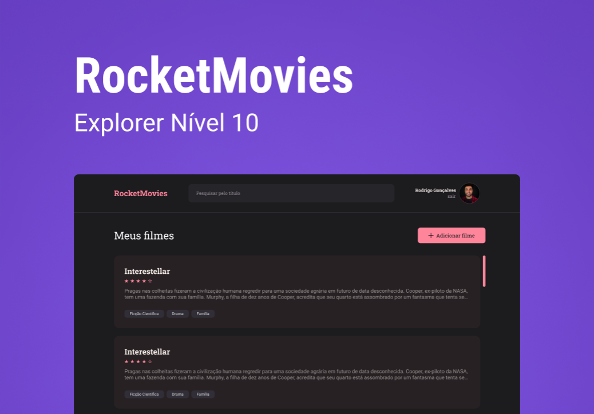

<h1 align="center">RocketMovies</h1>




## 📝 Tabela de conteúdos

- [Sobre](#about)
- [Iniciando o projeto](#getting_started)
- [Usando](#usage)
- [Tecnologias](#built_using)

## 🧐 Sobre <a name = "about"></a>
Este projeto foi criado durante o curso Exporer da Rocketseat, com o obejtivo de listar os seus filmes favoritos, podendo dar a cada um deles uma nota de 0 a 5 e uma descrição ou avaliação da sua escolha.

## 🏁 Iniciando o projeto <a name = "getting_started"></a>

Essas instruções vão te guiar para ter uma cópia da aplicação funcionando em sua máquina local.

### Pré-requisitos

Inicialmente você vai precisar de alguns programas instalados para que consiga fazer uso:

- [Visual Studio Code](https://code.visualstudio.com) - Editor de código
- [Node.js + npm](https://nodejs.org/en) - Versão LTS recomendada

### Instalando

Instruções passo a passo para utilizar a aplicação:

Feita a instalação mencionada, faça uma cópia do código fonte ou o download para sua máquina.

Abra os arquivos com o VSCODE e em seguida, abra o seu terminal integrado e execute o seguinte código:
```
npm install
```
Esse comando irá instalar todas as dependências necessárias para que consiga utilizar a aplicação.

Em seguida, execute a linha de comando a seguir para iniciar o servidor local:
```
npm run dev
```

## 🎈 Usando <a name="usage"></a>

Tendo executado o servidor local, clique no link informado no terminal ou o digite no seu navegador para ter acesso à aplicação.

*Para acessar as páginas de login e de criação de usuários, acesse o arquivo "src/routes/index.jsx" e altere o valor contido dentro do "BrowserRouter" para o "AuthRoutes."*

## ⛏️ Tecnologias <a name = "built_using"></a>

- [HTML](https://developer.mozilla.org/pt-BR/docs/Web/HTML)
- [CSS](https://developer.mozilla.org/pt-BR/docs/Web/CSS)
- [JavaScript](https://developer.mozilla.org/pt-BR/docs/Web/JavaScript)
- [ReactJs](https://react.dev)
- [Vite](https://vitejs.dev)
- [NodeJs](https://nodejs.org/en/)
- [Styled Components](https://styled-components.com)
- [React Router DOM](https://reactrouter.com/en/main)
- [React Icons](https://react-icons.github.io/react-icons/)

